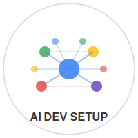
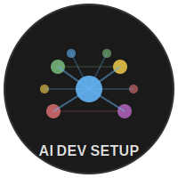

# Assets y Recursos Visuales

Esta carpeta contiene los recursos visuales del proyecto.

## Logos

### Logo Light (modo claro)


**Uso**: Fondos claros, documentación, sitios web con tema claro

**Archivo**: `logo-light.svg`

### Logo Dark (modo oscuro)


**Uso**: Fondos oscuros, IDEs con tema oscuro, GitHub dark mode

**Archivo**: `logo-dark.svg`

## Colores

### Palette Principal

#### Modo Claro
- **Primary (Blue)**: `#4285f4`
- **Success (Green)**: `#34a853`
- **Warning (Yellow)**: `#fbbc04`
- **Error (Red)**: `#ea4335`
- **Info (Purple)**: `#673ab7`
- **Text**: `#333333`
- **Background**: `#ffffff`

#### Modo Oscuro
- **Primary (Blue)**: `#64b5f6`
- **Success (Green)**: `#81c784`
- **Warning (Yellow)**: `#ffd54f`
- **Error (Red)**: `#e57373`
- **Info (Purple)**: `#ba68c8`
- **Text**: `#e0e0e0`
- **Background**: `#1a1a1a`

## Uso en Markdown

```markdown
# Modo claro


# Modo oscuro

```

## Uso en HTML

```html
<!-- Modo claro -->


<!-- Modo oscuro -->


<!-- Responsive (switch automático según tema) -->
<picture>
  <source srcset="./assets/logo-dark.svg" media="(prefers-color-scheme: dark)">
  
</picture>
```

## Modificación

Los logos son archivos SVG, puedes editarlos con:

- [Figma](https://figma.com) (online)
- [Inkscape](https://inkscape.org) (desktop)
- Cualquier editor de texto (son XML)

## Licencia

Los logos de este proyecto están bajo la misma licencia que el repositorio (ver [LICENSE](../LICENSE)).

Los logos de terceros (Google Antigravity, Claude, OpenAI, etc.) son propiedad de sus respectivos dueños.
